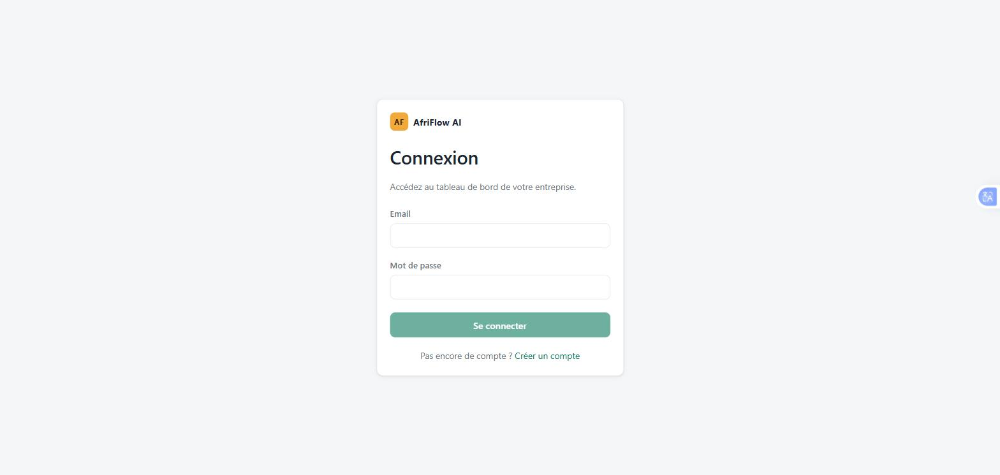
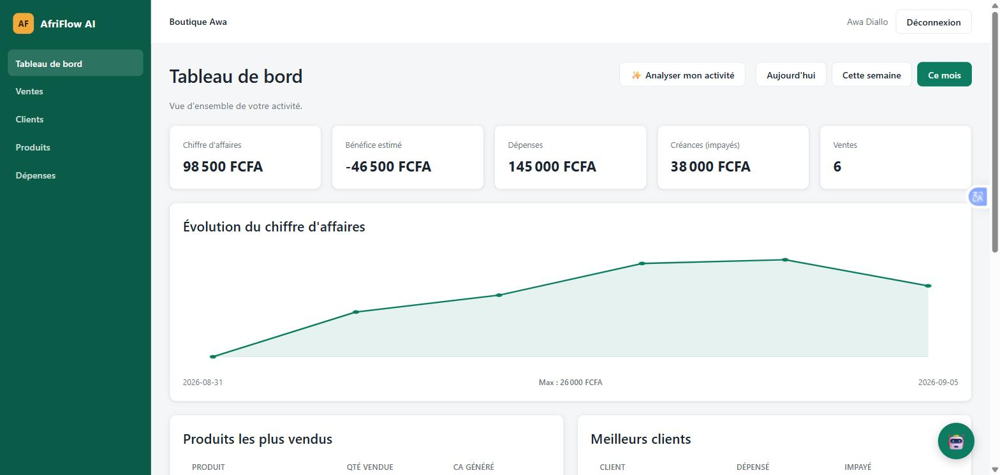
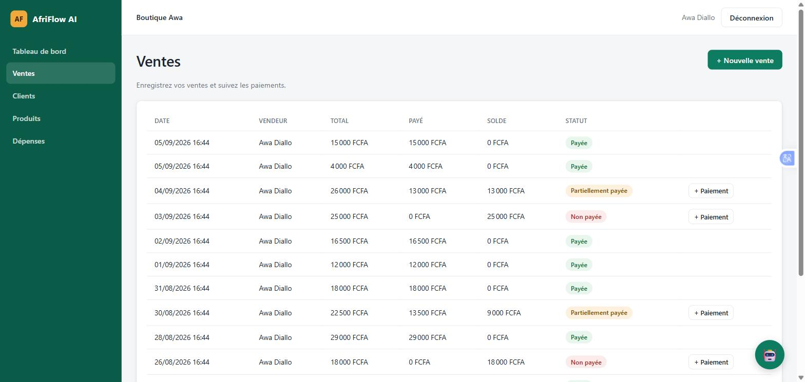
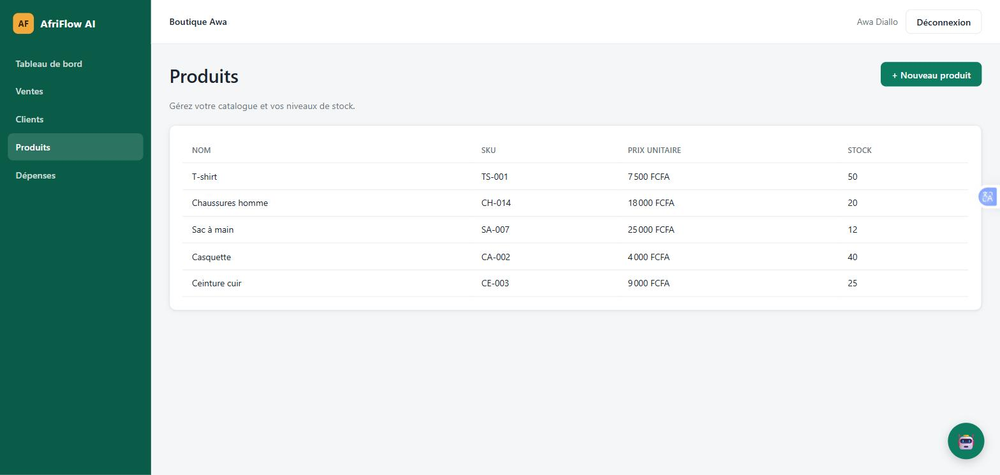

# AfriFlow AI

**Le copilote business intelligent pour les PME africaines.**

AfriFlow AI centralise ventes, clients, dépenses et trésorerie d'une petite
entreprise, et permet d'interroger ces données en langage naturel grâce à un
assistant IA branché directement sur la base de données de l'entreprise.

> ⚠️ Projet en développement actif — voir la [Roadmap](#roadmap) pour l'état d'avancement.

---

## Captures d'écran

| Connexion | Tableau de bord |
| --- | --- |
|  |  |

| Ventes | Produits |
| --- | --- |
|  |  |

---

## Sommaire

- [Captures d'écran](#captures-décran)
- [Le problème](#le-problème)
- [La solution](#la-solution)
- [Fonctionnalités](#fonctionnalités)
- [Le copilote IA](#le-copilote-ia)
- [Architecture](#architecture)
- [Stack technique](#stack-technique)
- [Installation](#installation)
- [Déploiement en production](#déploiement-en-production)
- [API](#api)
- [Sécurité](#sécurité)
- [Roadmap](#roadmap)
- [Licence](#licence)

---

## Le problème

La majorité des PME africaines gèrent encore leurs ventes, leurs clients et
leur trésorerie sur papier, sur WhatsApp ou sur des tableurs Excel dispersés.
Résultat : aucune visibilité en temps réel sur la santé réelle de l'activité,
et des décisions prises à l'aveugle (stock, prix, relance clients, dépenses).

Les logiciels de gestion existants sont soit trop chers, soit pensés pour des
marchés occidentaux (devises, fiscalité, méthodes de paiement) sans notion de
FCFA ni de mobile money.

## La solution

AfriFlow AI est un SaaS de gestion pensé pour ce contexte :

- suivi des ventes, clients, produits et dépenses en FCFA ;
- tableau de bord en temps réel (chiffre d'affaires, bénéfices, créances) ;
- un assistant IA capable de répondre en langage naturel à des questions sur
  les données réelles de l'entreprise (pas un chatbot générique) :

```text
"Combien ai-je gagné cette semaine ?"
"Quels produits se vendent le mieux ?"
"Pourquoi mon chiffre d'affaires baisse ?"
"Quels clients n'ont pas encore payé ?"
"Donne-moi 3 recommandations pour augmenter mes ventes."
```

## Fonctionnalités

- **Tableau de bord** — CA du jour/semaine/mois, bénéfice estimé, dépenses,
  créances, top produits, évolution du CA.
- **Ventes** — création de vente multi-produits, remises, mode de paiement
  (espèces, mobile money, autre), historique.
- **Clients** — fiche client, historique d'achats, montant dépensé, dettes.
- **Dépenses** — catégorisation (transport, salaire, stock, loyer, marketing,
  fournisseurs...), visualisation par catégorie et période.
- **Copilote IA** — questions en langage naturel sur les données réelles de
  l'entreprise, et rapport d'analyse automatique de l'activité.

## Le copilote IA

Le copilote ne fait pas que "discuter" : il traduit une question en langage
naturel en requête structurée sur les données réelles de l'entreprise, puis
formule une réponse à partir du résultat.

```text
Question utilisateur
       │
       ▼
Détection d'intention
       │
       ▼
Appel d'un outil métier (ex: get_sales_statistics)
       │
       ▼
Requête PostgreSQL
       │
       ▼
Résultat structuré
       │
       ▼
Réponse en langage naturel (LLM)
```

Fonction phare : **« Analyser mon activité »**, qui génère un rapport
automatique (performance, produit phare, points d'attention, recommandations,
objectif suggéré pour le mois suivant).

Implémentation concrète (backend, via l'[API Claude](https://console.anthropic.com)
d'Anthropic, modèle `claude-opus-5`) :

- `POST /api/copilot/ask` — boucle de function calling : le modèle choisit
  parmi 5 outils métier (`get_sales_summary`, `get_top_products`,
  `get_top_customers`, `get_customers_with_unpaid_balance`,
  `get_expenses_by_category`), chacun exécutant une requête Doctrine réelle
  scopée à l'entreprise de l'utilisateur, avant de formuler sa réponse.
- `POST /api/copilot/analyze` — agrège les statistiques du mois en cours puis
  demande au modèle de rédiger le rapport structuré en un seul appel.

Nécessite une clé `ANTHROPIC_API_KEY` (voir [Démarrage rapide](#démarrage-rapide)).
Sans clé configurée, ces deux endpoints renvoient une erreur — le reste de
l'application fonctionne normalement.

## Architecture

```text
┌──────────────────┐        REST / JSON         ┌──────────────────┐
│  Angular 22       │ ─────────────────────────▶ │  Symfony 8 (API)  │
│  frontend/         │ ◀───────────────────────── │  backend/          │
└──────────────────┘                             └─────────┬────────┘
                                                            │
                                              ┌─────────────┼─────────────┐
                                              ▼                           ▼
                                     ┌──────────────────┐        ┌──────────────────┐
                                     │   PostgreSQL 16   │        │   Couche IA        │
                                     │                    │        │   LLM + outils      │
                                     └──────────────────┘        │   métier            │
                                                                   └──────────────────┘
```

- `frontend/` — application Angular (dashboard, ventes, clients, dépenses).
- `backend/` — API Symfony (API Platform), authentification JWT, logique
  métier, exposition d'outils structurés pour la couche IA.
- `infrastructure/` — Dockerfiles de build pour le backend et le frontend.
- `docker-compose.yml` — environnement de développement complet (API,
  frontend, PostgreSQL, Adminer).

## Stack technique

| Composant       | Techno                                   |
| ---------------- | ----------------------------------------- |
| Frontend          | Angular 22, TypeScript, SCSS              |
| Backend           | Symfony 8, PHP 8.4, API Platform          |
| Base de données   | PostgreSQL 16, Doctrine ORM               |
| Authentification  | JWT (LexikJWTAuthenticationBundle)        |
| IA                | API Claude (Anthropic), function calling  |
| Infrastructure    | Docker, Docker Compose                    |
| CI                | GitHub Actions                            |

## Installation

### Prérequis

- Docker et Docker Compose (recommandé — c'est le seul prérequis dans ce cas)
- Sans Docker : PHP 8.4+, Composer, Node.js 22+, PostgreSQL 16

### Avec Docker (recommandé)

```bash
git clone https://github.com/<ton-compte>/afriflow-ai.git
cd afriflow-ai
cp backend/.env backend/.env.local
echo "ANTHROPIC_API_KEY=sk-ant-..." >> backend/.env.local   # requis pour le copilote IA
docker compose up -d
```

C'est tout : au premier démarrage, le conteneur backend génère lui-même sa
paire de clés JWT et applique les migrations avant de démarrer (voir
`backend/docker-entrypoint.sh`) — pas d'étape manuelle supplémentaire, même
sur un clone tout neuf sans `vendor/` ni `node_modules/` locaux (les
dépendances sont installées **dans** les conteneurs, sur des volumes dédiés,
pas sur le dossier du host).

- Frontend : http://localhost:4200
- API : http://localhost:8000
- Documentation API (OpenAPI) : http://localhost:8000/api
- Adminer (DB) : http://localhost:8080 (serveur `database`, base `afriflow`,
  utilisateur/mot de passe `afriflow`)

Pour explorer l'application tout de suite avec des données réalistes plutôt
que de créer un compte à la main :

```bash
docker compose exec backend php bin/console app:seed-demo
```

Crée l'entreprise « Boutique Awa » avec des produits, clients, ventes
(payées, partielles, impayées) et dépenses des dernières semaines. Identifiants
affichés à la fin de la commande : `demo@afriflow.ai` / `demo1234`.

### Sans Docker

```bash
# Base de données (PostgreSQL 16 déjà installé et démarré)
createdb afriflow

# Backend
cd backend
composer install
echo 'DATABASE_URL="postgresql://<user>:<pass>@127.0.0.1:5432/afriflow?serverVersion=16&charset=utf8"' >> .env.local
php bin/console lexik:jwt:generate-keypair --skip-if-exists
php bin/console doctrine:migrations:migrate --no-interaction
php bin/console app:seed-demo   # optionnel : données de démo
symfony serve -d               # ou : php -S 127.0.0.1:8000 -t public

# Frontend (dans un autre terminal)
cd frontend
npm install
npm start
```

### Dépannage

- **Port déjà utilisé (5432, 8000, 4200...)** : un PostgreSQL local ou un
  autre projet peut déjà occuper ces ports. Le `docker-compose.yml` expose
  volontairement PostgreSQL sur le port hôte **5433** (et non 5432) pour
  cette raison. Si 8000/4200/8080 sont pris chez toi, change simplement le
  port hôte dans `docker-compose.yml` (ex. `"8090:8000"`) — le réseau interne
  Docker entre les services n'est pas affecté.
- **`docker compose up` échoue après un crash de Docker Desktop** : relance
  simplement `docker compose up -d` ; les volumes nommés (`backend_vendor`,
  `frontend_node_modules`, `afriflow_db`) survivent au crash. Si le frontend
  affiche une erreur de dépendances corrompues au démarrage, force une
  réinstallation propre : `docker compose down frontend && docker volume rm
  afriflow_frontend_node_modules && docker compose up -d frontend`.
- **Le copilote IA répond par une erreur générique** : vérifie que
  `ANTHROPIC_API_KEY` est bien défini dans `backend/.env.local` (ou dans les
  variables d'environnement du conteneur backend), puis redémarre le service
  backend.

## Déploiement en production

Ce dépôt est configuré pour une démo/un portfolio, pas pour de la charge
réelle — quelques points à revoir avant un vrai déploiement :

- Définir `APP_ENV=prod` (et ne pas monter `APP_DEBUG=1`) pour le backend :
  les erreurs ne doivent jamais exposer de stack trace en production.
- Remplacer le serveur de dev `php -S` (utilisé par
  `infrastructure/backend/Dockerfile` pour rester simple) par FrankenPHP,
  PHP-FPM + Nginx, ou tout serveur adapté à de la charge concurrente.
- Générer un `APP_SECRET` et une passphrase JWT propres à l'environnement
  (`.env` ne contient que des valeurs de développement), et gérer les secrets
  via un vault plutôt que des variables d'environnement en clair.
- Si le backend est répliqué sur plusieurs conteneurs, `LOCK_DSN` doit
  pointer vers un store partagé atteignable par toutes les instances (le
  store PostgreSQL avisory déjà configuré convient, à condition que toutes
  les instances parlent à la même base).
- Mettre un reverse proxy / CDN devant le frontend buildé
  (`ng build`, servi par `infrastructure/frontend/Dockerfile` via Nginx) au
  lieu du serveur de dev Angular utilisé par `docker-compose.yml`.

### Déploiement Vercel (frontend) + Railway (backend)

Vercel n'a pas de runtime PHP officiel et son modèle serverless (une requête =
une invocation isolée, sans connexion persistante) est incompatible avec le
verrouillage PostgreSQL (`symfony/lock`) qui protège les ventes/paiements
contre les écritures concurrentes — le frontend Angular (statique après
build) va sur Vercel, le backend Symfony va sur une plateforme à conteneurs
longue durée comme Railway.

**Backend sur Railway :**

1. Nouveau projet Railway → *Deploy from GitHub repo* → sélectionner ce
   dépôt. `railway.json` à la racine indique déjà à Railway d'utiliser
   `infrastructure/backend/Dockerfile` avec `backend/` comme contexte de
   build.
2. Ajouter un service **PostgreSQL** (bouton *+ New* → *Database* →
   *PostgreSQL*) dans le même projet Railway.
3. Sur le service backend, définir les variables d'environnement :
   - `DATABASE_URL` → référencer la variable de connexion du service Postgres
     (`${{Postgres.DATABASE_URL}}` dans l'UI Railway), en gardant les query
     params `?serverVersion=16&charset=utf8`
   - `LOCK_DSN` → même valeur que `DATABASE_URL` mais avec le schéma
     `postgresql+advisory://` à la place de `postgresql://`
   - `APP_ENV=prod`
   - `APP_SECRET` → générer une valeur propre (`openssl rand -hex 16`), ne
     pas réutiliser celle de `.env`
   - `JWT_PASSPHRASE` → générer une valeur propre, différente de `.env`
   - `ANTHROPIC_API_KEY` → ta clé Claude
   - `CORS_ALLOW_ORIGIN` → l'URL du frontend Vercel une fois connue, ex.
     `^https://afriflow-ai\.vercel\.app$`
4. Railway assigne un domaine public (`*.up.railway.app`) et injecte son
   propre `$PORT` — le conteneur s'y adapte automatiquement
   (`backend/docker-entrypoint.sh`). Note cette URL, elle sert à l'étape
   suivante.
5. Lance `docker compose exec backend php bin/console app:seed-demo`
   équivalent sur Railway via son onglet *Shell* du service, si tu veux des
   données de démo.

**Frontend sur Vercel :**

1. Modifier `frontend/src/environments/environment.ts` : remplacer
   `apiUrl: '/api'` par l'URL Railway obtenue ci-dessus, ex.
   `apiUrl: 'https://afriflow-backend-production.up.railway.app/api'`, et
   commit/push.
2. Nouveau projet Vercel → *Import Git Repository* → sélectionner ce dépôt.
3. Dans les réglages du projet, définir **Root Directory** sur `frontend`.
   Vercel détecte alors `frontend/vercel.json` (déjà présent dans le dépôt),
   qui fixe la commande de build et le dossier de sortie
   (`dist/frontend/browser`) et redirige toutes les routes vers `index.html`
   (nécessaire pour le routing côté client d'Angular).
4. Déployer. Une fois l'URL Vercel connue, retourner sur Railway et mettre à
   jour `CORS_ALLOW_ORIGIN` avec cette URL exacte.

## API

L'API suit une architecture REST exposée par API Platform, avec documentation
OpenAPI générée automatiquement et consultable sur `/api`.

Ressources principales : `Customer`, `Product`, `Sale` (avec ses `SaleItem`),
`Expense`, `Payment`. Chaque entreprise ne voit que ses propres données
(isolation multi-tenant appliquée au niveau de la couche Doctrine, voir
[Sécurité](#sécurité)).

Une couche de statistiques (`/api/stats/*`) expose en plus, pour une période
donnée (`?from=&to=`) :

| Endpoint                     | Contenu                                              |
| ----------------------------- | ----------------------------------------------------- |
| `GET /api/stats/summary`      | CA, bénéfice estimé, dépenses, créances, nb de ventes |
| `GET /api/stats/top-products` | Produits les plus vendus (quantité + CA généré)       |
| `GET /api/stats/top-customers`| Meilleurs clients (dépensé + impayé)                  |
| `GET /api/stats/revenue-series`| Évolution du CA jour par jour, pour le graphique     |

### Authentification

```bash
# 1. Créer un compte (entreprise + premier utilisateur admin)
curl -X POST http://localhost:8000/api/register \
  -H "Content-Type: application/json" \
  -d '{"companyName":"Boutique Awa","fullName":"Awa Diallo","email":"awa@boutique-awa.sn","password":"password123"}'

# 2. Se connecter pour obtenir un token JWT
curl -X POST http://localhost:8000/api/login_check \
  -H "Content-Type: application/json" \
  -d '{"email":"awa@boutique-awa.sn","password":"password123"}'

# 3. Appeler l'API avec le token
curl http://localhost:8000/api/me -H "Authorization: Bearer <token>"
```

### Enregistrer une vente

```bash
curl -X POST http://localhost:8000/api/sales \
  -H "Authorization: Bearer <token>" \
  -H "Content-Type: application/ld+json" \
  -d '{
    "customerId": 1,
    "paymentMethod": "mobile_money",
    "items": [{"productId": 1, "quantity": 2}]
  }'
```

La réponse inclut `totalAmount`, `amountPaid`, `balanceDue` et `status`
(`unpaid` / `partially_paid` / `paid`), recalculés automatiquement à chaque
paiement enregistré via `POST /api/payments`.

## Sécurité

- Authentification par JWT, un utilisateur appartenant à une seule entreprise
  (isolation des données multi-tenant au niveau applicatif via un filtre SQL
  Doctrine appliqué globalement, y compris sur les écritures — voir
  `TenantIsolationTest`).
- Rate limiting sur `/api/login_check` (5 tentatives / 15 min) et
  `/api/register` (5 / heure) pour limiter le brute-force et la création
  massive de comptes.
- Validations métier au-delà du simple typage : impossible de survendre un
  produit, d'appliquer une remise supérieure au total d'une vente, ou
  d'enregistrer un paiement supérieur au solde dû. Ces vérifications sont
  protégées par des verrous (`symfony/lock`, backés par PostgreSQL) contre
  les écritures concurrentes sur un même produit ou une même vente.
- Plages de dates des statistiques bornées (366 jours max) pour éviter un
  déni de service par requête `from`/`to` disproportionnée.
- Validation des entrées via le composant Validator de Symfony.
- Secrets (clés JWT, `APP_SECRET`, identifiants base de données) exclus du
  dépôt via `.gitignore` et gérés par variables d'environnement.

## Roadmap

- [x] Jour 1 — Architecture : scaffolding Angular/Symfony, Docker, CI, README
- [x] Jour 2 — Backend : entités, migrations, API REST, authentification JWT,
      isolation multi-tenant, tests fonctionnels
- [x] Jour 3 — Frontend : auth, dashboard, ventes (avec paiements), clients,
      produits, dépenses — logiciel utilisable de bout en bout
- [x] Jour 4 — Business intelligence : endpoints d'agrégation (`/api/stats/*`),
      sélecteur de période, graphique d'évolution du CA, top produits/clients
- [x] Jour 5 — Copilote IA : chat avec function calling (API Claude) sur les
      données métier réelles, rapport d'activité automatique
- [x] Jour 6 — Audit qualité : faille IDOR corrigée, validations financières
      (survente, remise/paiement excessifs), rate limiting, N+1, gestion
      d'erreurs et sidebar responsive côté frontend
- [x] Jour 7 — Déploiement : `docker compose up` validé de bout en bout sur un
      clone neuf, commande de seed de démonstration, captures d'écran,
      documentation d'installation et de déploiement, `v1.0.0`

## Licence

[MIT](LICENSE)
